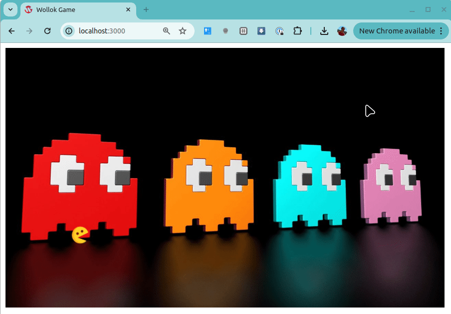

# Primer juego: Wollok Game
 
[](https://github.com/wollok/pacmanBasicGame/actions/workflows/ci.yml)


Para conocer Wollok Game vamos a desarrollar un pac-man básico con el que conoceremos los conceptos principales del juego.

# Primera iteración

## El tablero

Generamos un proyecto Wollok, con un programa. Lo primero que escribimos es

```wollok
program abc {
    
	// que arranque el juego!
	game.start()

}
```

Bueno, no es algo muy convincente, pero tenemos un tablero provisto por el wko game, que acabamos de conocer.

## Mejorando el tablero

Para que el tablero se vea un poco más interesante, vamos a 

- agrandar su tamaño, eso nos permitirá que luego nuestro personaje se pueda mover más confortablemente
- y pondremos una imagen bonita de fondo

Pueden elegir cualquiera de las imágenes que quieran, lo debemos guardar en una carpeta que tiene que ser **assets** (o puede ser alguna diferente si la configurás en [el archivo package.json](./package.json)). 

Ahora sí, podemos actualizar el programa, poniéndole un nombre más representativo que abc:

```js
program pacman {
	
	// límites del juego
	game.width(14)
	game.height(8)
	
	// fondo
	game.boardGround("pacmanBackground.jpg")
	
	// que arranque el juego!
	game.start()
	
}
```

## Agregando un personaje principal

Vamos a crear un pacman, en el archivo example.wlk que nos generó el IDE de Wollok. El pacman será nuestro personaje principal, y al igual que cualquier otro elemento visual del juego, debe tener como atributos:

- una imagen asociada (para que el jugador lo identifique en el tablero)
- y una posición inicial dentro del tablero

Escribimos entonces nuestro pacman:

```wollok
object pacman {
	var property image = "pacman.png"
	var property position = game.origin()
}
```

La imagen corresponde a un nombre de archivo que debe existir en la carpeta "asset" o como lo quieran llamar, y que debe ser una carpeta fuente. El wko game ofrece un mensaje origin() para ubicarlo en la esquina izquierda inferior del tablero.

Solamente necesitamos agregarlo al tablero de la siguiente manera:

```wollok
program pacman {
	
    ...
	
	// personaje principal
	game.addVisualCharacter(pacman)
	
	// que arranque el juego!
	game.start()
	
}
```

Y listo! Tenemos una primera versión de nuestro juego:



# Cómo seguir con el tutorial

Desde una línea de comando, escribí 

```bash
$ git checkout 02-rivales
$ git pull
```

y leé el archivo README de ese branch. También podés navegar este mismo ejemplo en github:

https://github.com/wollok/pacmanBasicGame

y arriba a la izquierda, donde dice Branch: **master** lo cambiás al **02-rivales**

